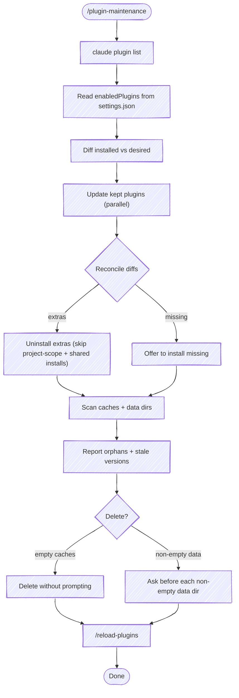

# Plugin Maintenance

Reconcile installed Claude Code plugins against the **desired set** declared in `~/.claude/settings.json` (`enabledPlugins`), then update what stays, install what's missing, uninstall what doesn't belong, and prune stale caches and data dirs.

The `claude plugin uninstall` command does **not** prune `~/.claude/plugins/cache/` or `~/.claude/plugins/data/`. This skill does, but only with confirmation — data dirs may hold user state worth preserving.

## Source of truth

- **Desired plugins:** `~/.claude/settings.json` → `enabledPlugins` (a map of `<plugin>@<marketplace>` → bool). This is the set you've declared should be enabled; the disk state may have drifted from it.
- **Installed plugins:** `claude plugin list` output. Format: each entry has `<plugin>@<marketplace>`, `Version`, `Scope` (user/project/local), `Status` (enabled/disabled).

## Guardrail: project-scope team-shared plugins

Plugins with **Scope: project** are checked into a repo's `.claude/settings.json` and shared with the team. **Do not uninstall them** — `claude plugin uninstall` will fail with a clear error. Report them as "skipped (team-shared)" and move on. User-scope plugins are personal and safe to reconcile.

## Guardrail: a plugin shared by two marketplaces

The same plugin can be published to more than one marketplace — a public marketplace and a separate mirror, say. When both are registered (common while migrating from one to the other), `claude plugin list` shows two rows for that plugin — `foo@marketplace-a` and `foo@marketplace-b` — but `installed_plugins.json` records the install **once**, under whichever marketplace it was installed from. The other row points at that same on-disk install.

`claude plugin uninstall foo@marketplace-a` then removes the plugin's only install record, uninstalling `foo` entirely — including the copy that was enabled and in use — and returns a success message regardless, so the command's exit can't confirm the intended "remove just this marketplace copy" effect.

**The tell:** a `<plugin>@<marketplace>` row in `claude plugin list` that has no matching key in `installed_plugins.json`, while another row for the same plugin name does. That row shares the single on-disk install — uninstalling it deletes the shared copy.

So gate every extra uninstall on the install manifest, not on `claude plugin list` plus the desired set alone (Step 3). A plugin with genuinely independent install records per marketplace — a key present in the manifest for each marketplace — is reconciled as before.

## Flow



## Step 1: Inventory

Run in parallel:

```bash
claude plugin list
```

```bash
cat ~/.claude/settings.json | jq '.enabledPlugins'
```

Build two sets of `<plugin>@<marketplace>` keys: **installed** (with scope) and **desired**.

Also read the install manifest — Step 3 gates uninstalls on it (see "a plugin shared by two marketplaces"):

```bash
jq '.plugins | keys' ~/.claude/plugins/installed_plugins.json
```

The manifest keys by the same `<plugin>@<marketplace>` form. A `claude plugin list` row whose key is absent here shares another marketplace's single on-disk install.

While you have the marketplace state, note **auto-update** coverage for the final report — a marketplace is auto-updating when its `extraKnownMarketplaces.<name>.autoUpdate` is `true` in `~/.claude/settings.json`:

```bash
jq '.extraKnownMarketplaces | to_entries | map({(.key): (.value.autoUpdate // false)}) | add' ~/.claude/settings.json
```

shipshape's `SessionStart` hook enforces this — it arms any marketplace missing the flag, effective next launch — so the skill only **reports** status here; it doesn't write. Surface any marketplace still showing `false` so the user knows the hook will pick it up.

## Step 2: Update kept plugins

For every plugin that appears in **both** sets, run `claude plugin update` in parallel:

```bash
claude plugin update <plugin>@<marketplace>
```

Report which had updates available and which were already current.

## Step 3: Reconcile differences

- **Extras** (installed, not desired):
  - **Shared on-disk install** (the extra's `<plugin>@<marketplace>` key is absent from `installed_plugins.json`, but another row for the same plugin name is present) → **do not uninstall.** Removing this marketplace key deletes the plugin's only install record, taking the enabled copy with it. Surface it as a warning with the evidence — the row is enabled in `claude plugin list` yet absent from the manifest — and let the user resolve it deliberately: re-point `enabledPlugins` to the desired marketplace, or uninstall and reinstall from that marketplace. Report as "skipped (shared install)".
  - **User-scope** → `claude plugin uninstall <plugin>@<marketplace> -y`, then confirm against the manifest: re-read `installed_plugins.json` and check the key is gone. The uninstall reports success regardless, so verify the effect rather than trusting the message.
  - **Project-scope** → skip with a warning ("team-shared via repo settings; remove from the repo's `.claude/settings.json` instead")
- **Missing** (desired, not installed):
  - Offer to install: `claude plugin install <plugin>@<marketplace>`
  - Ask before installing — the desired set may be aspirational or out-of-date.

**Report by exception.** The desired set is usually large and mostly current on any given run — enumerating every plugin buries the few rows that matter under a wall of `current`. Show a row only for plugins whose status is **not** `current`: `updated`, `uninstalled`, `install? (missing)`, `skipped (team-shared)`, `skipped (shared install)`. Collapse everything that was already current into a single trailing line — a count, not rows.

Order the columns `Marketplace | Plugin | Previous Version | Current Version | Status`. For upgraded plugins, show the version transition across the two version columns. The **Status** column carries `updated` / `skipped (team-shared)` / `skipped (shared install)` / `uninstalled` / `install? (missing)`.

```text
| Marketplace    | Plugin    | Previous Version | Current Version | Status                |
|----------------|-----------|------------------|-----------------|-----------------------|
| chris-peterson | beacon    | 1.1.0            | 1.3.0           | updated               |
| chris-peterson | moor      | 0.6.1            | 0.7.0           | updated               |
| official       | gitlab    | —                | 1.2.0           | skipped (team-shared) |

17 other plugins already current.
```

If nothing changed at all — no updates, no extras, no missing — skip the table and say so in one line: `All 20 desired plugins installed and current; nothing to reconcile.`

## Step 4: Scan caches and data dirs

After reconcile, scan both directories. The cache layout is `~/.claude/plugins/cache/<marketplace>/<plugin>/<version>/`. The data layout is `~/.claude/plugins/data/<plugin>-<marketplace>/` (note: hyphen-joined, not `@`).

```bash
find ~/.claude/plugins/cache -mindepth 3 -maxdepth 3 -type d
```

```bash
find ~/.claude/plugins/data -mindepth 1 -maxdepth 1 -type d
```

Classify every entry against the **currently installed** set (use `claude plugin list` again — the inventory just changed):

- **Orphan cache** — `<plugin>@<marketplace>` no longer installed. Delete-eligible (subject to the `.in_use` check below).
- **Stale version cache** — `<plugin>@<marketplace>` is installed but `<version>` doesn't match the current installed version. Delete-eligible (subject to the `.in_use` check below). Nothing prunes these automatically — left alone they accumulate, and since each version dir is loaded at the startup of any session pinned to it, that's wasted disk and a heavier plugin set. Running this skill is what keeps the cache at one version per plugin.
- **Orphan data dir** — `<plugin>-<marketplace>` slug doesn't match any installed plugin. This is the orphan class nothing else cleans: `claude plugin uninstall` doesn't remove data dirs, and the version-cache lifecycle never touches them. Watch for **legacy slugs** like `<plugin>-inline` left over from local/inline installs. These look orphaned because the slug style changed, not because the plugin was uninstalled — flag them clearly so the user knows the data may still matter.

### Respect `.in_use` leases

Each plugin version dir carries an `.in_use/` directory in which every running session drops a lease file — `{"pid":<n>,"procStart":"<ts>"}`. It's a reference count: a version dir is **live** if any lease names a running process. **Never delete a cache dir with a live lease** — another session loaded that version at startup and is still using its hooks/skills; pruning it breaks that session until it restarts. A lease whose PID is dead is stale and safe to ignore (a platform sweep, recorded in `~/.claude/plugins/.last_inuse_sweep`, eventually clears dead leases).

```bash
# A version dir is in use if any lease names a live process.
in_use() {
  for lease in "$1"/.in_use/*; do
    [ -e "$lease" ] || continue
    ps -p "$(jq -r .pid "$lease")" >/dev/null 2>&1 && return 0
  done
  return 1
}
```

(The `.in_use` mechanism is observed from disk, not documented — treat it as a conservative safety check: when a lease looks live, don't prune.)

**Report by exception here too.** Stale-version caches are routine — every update leaves one behind — and they're auto-deletable (Step 5), so they don't warrant a row each. Roll them into a single line: count and total size. Reserve table rows for the classes that need user judgment: **orphan caches/data** and **legacy slugs**. If there are none of those, a one-line summary is the whole report.

```text
Stale-version caches: 12 dirs, ~70M — auto-pruned.
```

When orphans or legacy slugs are present, table only those:

```text
| Path                                     | Class       | Size |
|------------------------------------------|-------------|------|
| ~/.claude/plugins/data/beacon-inline     | legacy slug | 744K |
| ~/.claude/plugins/data/old-plugin-old-mp | orphan data | 0    |
```

## Step 5: Clean up (with confirmation)

- **Live-leased cache dirs** (the `.in_use` check above passed) — **never delete**, regardless of class. A live session is loaded from it; pruning breaks that session. Report as "skipped (in use)".
- **Empty cache dirs and orphan/stale caches with no live lease** — safe to delete; do it without asking.
- **Non-empty data dirs** — **ask first**. They may hold user state (settings, history, accumulated context). Quote the size and a sample of file names so the user can decide.
- **Legacy-slug data dirs** — never auto-delete. Show the slug, the size, and the suspected current slug so the user can choose to migrate, archive, or remove.

Use `rm -rf` only after explicit confirmation for non-empty dirs. Never delete the parent `cache/<marketplace>/` or `data/` directories themselves.

## Step 6: Reload plugins

Installs, uninstalls, and updates change plugins on disk but don't take effect in the running session — Claude Code reads the plugin set once at startup and freezes it. `/reload-plugins` re-reads it in place (no restart). It's a built-in command that only a human can type: there's no CLI flag, hook, or skill that triggers a reload, and no way to reload across sessions — each running session is an independent process. So the reconcile only lands where the user runs the reload:

```text
Ask the user to run /reload-plugins in this session — and in any other active
Claude Code session, since each loads plugins independently.
```

Two notes worth stating in the report:

- **Other running sessions still need their own reload.** This reconcile only landed in the session that ran it; every other live session keeps the plugin set it loaded at startup until it reloads or restarts. (Their *loaded* version dirs were protected from pruning by the `.in_use` check in Step 5 — they're stale, not broken.)
- **Reload is rarely needed going forward.** With marketplace auto-update on (shipshape's `SessionStart` hook), every new session loads the current set at launch. This step matters mainly for the session that just ran a manual reconcile.

Skip this entirely if Step 3 made no changes and Step 5 pruned nothing — there's nothing to reload.

## CLI reference

```bash
claude plugin list                                    # inventory
claude plugin update <plugin>@<marketplace>           # update
claude plugin install <plugin>@<marketplace>          # install
claude plugin uninstall <plugin>@<marketplace> -y     # uninstall (fails on project-scope)
claude plugin --help                                  # full subcommand list (includes prune, enable, disable)
```

`claude plugin prune` removes auto-installed dependencies that are no longer needed but does **not** touch caches or data dirs — that's still this skill's job.

## Paths

```text
Settings:              ~/.claude/settings.json  (enabledPlugins = desired set)
Cache:                 ~/.claude/plugins/cache/<marketplace>/<plugin>/<version>/
Data:                  ~/.claude/plugins/data/<plugin>-<marketplace>/
Known marketplaces:    ~/.claude/plugins/known_marketplaces.json
Installed manifest:    ~/.claude/plugins/installed_plugins.json
```
