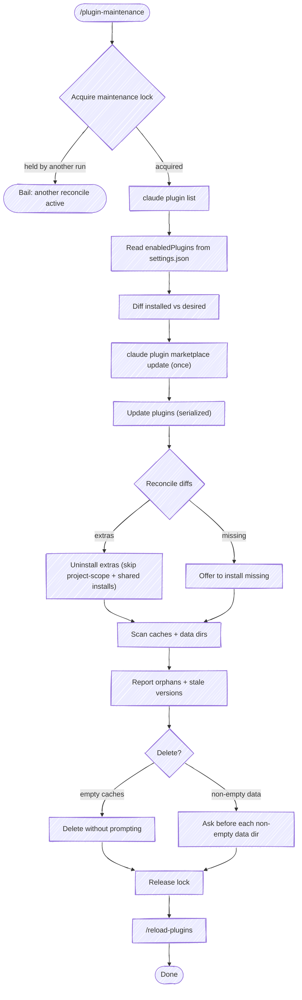

# Plugin Maintenance

Reconcile installed Claude Code plugins against the **desired set** declared in `~/.claude/settings.json` (`enabledPlugins`), then update what stays, install what's missing, uninstall what doesn't belong, and prune stale caches and data dirs.

The `claude plugin uninstall` command does **not** prune `~/.claude/plugins/cache/` or `~/.claude/plugins/data/`. This skill does, but only with confirmation — data dirs may hold user state worth preserving.

## Source of truth

- **Desired plugins:** `~/.claude/settings.json` → `enabledPlugins` (a map of `<plugin>@<marketplace>` → bool). This is the set you've declared should be enabled; the disk state may have drifted from it.
- **Installed plugins:** `claude plugin list` output. Format: each entry has `<plugin>@<marketplace>`, `Version`, `Scope` (user/project/local), `Status` (enabled/disabled).

## Guardrail: project-scope team-shared plugins

Plugins with **Scope: project** are checked into a repo's `.claude/settings.json` and shared with the team. **Do not uninstall them** — `claude plugin uninstall` will fail with a clear error. Report them as "skipped (team-shared)" and move on. User-scope plugins are personal and safe to reconcile.

## Guardrail: a plugin shared by two marketplaces

The same plugin can be published to more than one marketplace — a public marketplace and a separate mirror, say. When both are registered (common while migrating from one to the other), `claude plugin list` shows two rows for that plugin — `foo@marketplace-a` and `foo@marketplace-b` — but `installed_plugins.json` records the install **once**, under whichever marketplace it was installed from. The other row points at that same on-disk install.

`claude plugin uninstall foo@marketplace-a` then removes the plugin's only install record, uninstalling `foo` entirely — including the copy that was enabled and in use — and returns a success message regardless, so the command's exit can't confirm the intended "remove just this marketplace copy" effect.

**The tell:** a `<plugin>@<marketplace>` row in `claude plugin list` that has no matching key in `installed_plugins.json`, while another row for the same plugin name does. That row shares the single on-disk install — uninstalling it deletes the shared copy.

So gate every extra uninstall on the install manifest, not on `claude plugin list` plus the desired set alone (Step 3). A plugin with genuinely independent install records per marketplace — a key present in the manifest for each marketplace — is reconciled as before.

## Flow



## Output model: composition-first, scannable surfaces

Don't narrate the run as a scroll of per-plugin lines. Use three surfaces: an **inventory summary + plan table** up front, the **native task list** for progress, and a **scannable final report** at the end. Both the opening summary and the closing report lead with the same composition line (installed / enabled / disabled) and share one emoji vocabulary, so the run reads as one coherent thing.

### Voice: report outcomes, not your reasoning

The user cares about **what changed and what they must do next** — not how you figured it out. Do the reasoning silently and emit only results.

- **No per-tool-call preambles.** Don't announce each command before running it ("Now let me refresh the marketplaces…", "Lock's held and inventory's in…"). Run the tool; let its result and the tables speak. Between steps, stay silent unless you hit something the user must decide.
- **No narrated investigation.** If a check surprises you — a lease reads as in-use, a version looks off — resolve it with silent tool calls, then report the *conclusion* in one line. Never walk the user through your hypotheses, your `ps` spelunking, or your "that's almost certainly wrong… actually it's correct" reversals. That is internal dialog; it belongs in no message.
- **Trust the skill's own tooling.** The lock script and `plugin-cache-in-use.sh` return verdicts you act on, not verdicts you audit out loud (see Step 4). If the script says a dir is in use, it's in use — report it and move on.
- **Stay in scope.** Report only this run's plugin maintenance. Don't append status on unrelated parked work, other sessions' tasks, or what you were doing before the skill was invoked.
- **The final summary is scannable, not prose.** Emit it as the compact emoji-tagged status block defined in the output-format reference (surface 3) — composition line first (so the enabled/disabled split is declared, never introduced for the first time at the end), then reconcile / updates / cache / data as short lines or small tables, then the one action the user takes (`/reload-plugins`, or "nothing changed"). Group and count rather than listing every plugin; a run where everything was already current is a few lines, not a wall of rows.

The detailed specs for these three surfaces — the shared emoji vocabulary, the plan/progress/report layouts, and the terminal-is-append-only rationale behind them — live in **[references/output-format.md](references/output-format.md)**. Read it before rendering; the rest of this file assumes that vocabulary.

## Step 0: Take the maintenance lock

`claude plugin` has **no concurrency control**: install/update/uninstall all mutate the same shared state — the install manifest, the per-marketplace git clones, the per-version caches — with no locking. Two reconciles, or a reconcile overlapping another session's plugin operations, can interleave and leave that state in a mix neither intended (an uninstall in one session racing an update in another). So take a cooperative lock for the duration of the reconcile:

```bash
bash "${CLAUDE_PLUGIN_ROOT}/scripts/plugin-maintenance-lock.sh" acquire
```

- **Exit 0** — lock acquired (or already yours; it's re-entrant within a session). Proceed.
- **Exit 3** — another live session holds it. **Stop.** Tell the user another maintenance run is active (the script names the holding session and when it started on stderr) and that they should let it finish or, if it's a crashed run, wait for the lock to go stale. Don't reconcile past this.

Release it in Step 6, on every exit path. The lock self-clears if this run crashes (a lock older than the stale threshold is treated as abandoned and stolen by the next run), so a missed release degrades to a stale-lock steal, not a permanent block.

## Step 1: Inventory

These are read-only reads of disk state — safe to run in parallel (the concurrency hazard is only among *mutating* `claude plugin` operations, handled in Step 2):

```bash
claude plugin list
```

```bash
cat ~/.claude/settings.json | jq '.enabledPlugins'
```

Build two sets of `<plugin>@<marketplace>` keys: **installed** (with scope) and **desired**. Note the enabled/disabled split while you're here — it feeds the composition line. Once you've diffed them (Step 3's classification), render the **inventory summary + plan table** (surface 1 in references/output-format.md) — the composition line (installed / enabled / disabled) the user sees before anything changes.

Also read the install manifest — Step 3 gates uninstalls on it (see "a plugin shared by two marketplaces"):

```bash
jq '.plugins | keys' ~/.claude/plugins/installed_plugins.json
```

The manifest keys by the same `<plugin>@<marketplace>` form. A `claude plugin list` row whose key is absent here shares another marketplace's single on-disk install.

While you have the marketplace state, note **auto-update** coverage for the final report — a marketplace is auto-updating when its `extraKnownMarketplaces.<name>.autoUpdate` is `true` in `~/.claude/settings.json`:

```bash
jq '.extraKnownMarketplaces | to_entries | map({(.key): (.value.autoUpdate // false)}) | add' ~/.claude/settings.json
```

shipshape's `SessionStart` hook enforces this — it arms any marketplace missing the flag, effective next launch — so the skill only **reports** status here; it doesn't write. Surface any marketplace still showing `false` so the user knows the hook will pick it up.

## Step 2: Update plugins

**Do not blanket-parallelize updates.** `claude plugin update` refreshes the plugin's marketplace by re-cloning it; run several updates for plugins from the *same* marketplace at once (the common case) and the clones collide (`destination path already exists and is not an empty directory`), so some updates fail with `Plugin not found` and are silently skipped in the parallel output. The marketplace isn't damaged — a sequential retry succeeds immediately — but the failure hides in the noise.

Instead, **refresh every marketplace once, up front** (one command, internally sequential), so the per-plugin updates that follow aren't each re-cloning:

```bash
claude plugin marketplace update
```

Then update each plugin **serialized** — one at a time, not a parallel batch:

```bash
claude plugin update <plugin>@<marketplace>
```

Updates are fast and network-bound, and with the marketplaces already refreshed each one is cheap; the clone-collision cost far outweighs the parallelism. (If speed ever matters on a large set, the only safe parallelism is across *distinct* marketplaces — never two updates of the same marketplace at once.)

**Surface and retry failures — never lose one in the output.** If an update reports `Plugin not found` or another transient error, retry it once serially and reflect the real outcome in the final report. An update that stays failed is a row the user needs to see, not a silent gap.

Track the pass on the **native task list** (surface 2 in references/output-format.md) — mark the `Update plugins` task `in_progress` before the first update, `completed` after the last. Don't emit a line per plugin; the results land in the final report (Step 3).

## Step 3: Reconcile differences

- **Extras** (installed, not desired):
  - **Shared on-disk install** (see the guardrail above — the extra's key is absent from `installed_plugins.json` while another row for the same plugin name is present) → **do not uninstall.** Removing this marketplace key deletes the plugin's only install record, taking the enabled copy with it. Surface it as a warning with the manifest-vs-list evidence and let the user resolve it deliberately (re-point `enabledPlugins`, or uninstall and reinstall from the desired marketplace). Report as "skipped (shared install)".
  - **User-scope** → `claude plugin uninstall <plugin>@<marketplace> -y`, then confirm against the manifest: re-read `installed_plugins.json` and check the key is gone. The uninstall reports success regardless, so verify the effect rather than trusting the message.
  - **Project-scope** → skip with a warning ("team-shared via repo settings; remove from the repo's `.claude/settings.json` instead")
- **Missing** (desired, not installed):
  - Offer to install: `claude plugin install <plugin>@<marketplace>`
  - Ask before installing — the desired set may be aspirational or out-of-date.

The reconcile outcomes feed the **final report** (surface 3 in references/output-format.md) — the scannable, emoji-tagged status block, opening with the same composition line and reporting reconcile / updates / cache / data. Statuses map to the shared vocabulary: ⬆️ updated · ✅ current · ⏭️ skipped (team-shared / shared install) · 🗑️ uninstalled · ➕ install? (missing). Group and count rather than listing every plugin; if nothing changed at all, the report is the composition line plus a one-line "nothing to reconcile."

## Step 4: Scan caches and data dirs

After reconcile, scan both directories. The cache layout is `~/.claude/plugins/cache/<marketplace>/<plugin>/<version>/`. The data layout is `~/.claude/plugins/data/<plugin>-<marketplace>/` (note: hyphen-joined, not `@`).

```bash
find ~/.claude/plugins/cache -mindepth 3 -maxdepth 3 -type d
```

```bash
find ~/.claude/plugins/data -mindepth 1 -maxdepth 1 -type d
```

Classify every entry against the **currently installed** set (use `claude plugin list` again — the inventory just changed):

- **Orphan cache** — `<plugin>@<marketplace>` no longer installed. Delete-eligible (subject to the `.in_use` check below).
- **Stale version cache** — `<plugin>@<marketplace>` is installed but `<version>` doesn't match the current installed version. Delete-eligible (subject to the `.in_use` check below). Nothing prunes these automatically — left alone they accumulate, and since each version dir is loaded at the startup of any session pinned to it, that's wasted disk and a heavier plugin set. Running this skill is what keeps the cache at one version per plugin.
- **Orphan data dir** — `<plugin>-<marketplace>` slug doesn't match any installed plugin. This is the orphan class nothing else cleans: `claude plugin uninstall` doesn't remove data dirs, and the version-cache lifecycle never touches them. Flag a genuine orphan (a slug for a plugin that's truly gone) so the user can decide whether the data still matters.
- **`-inline` data dir** — **ignore it.** A `<plugin>-inline` slug is a benign artifact of testing a plugin locally (an inline/skills-dir install), not an orphan and not drift. Don't flag it, don't count it, don't offer to remove it — leave it alone and omit it from the report entirely.

### Respect `.in_use` leases

Each plugin version dir carries an `.in_use/` directory in which every running session drops a lease file — `{"pid":<n>,"procStart":"<ts>"}`. It's a reference count: a version dir is **live** if any lease names a running process **whose start time still matches the lease's `procStart`**. **Never delete a cache dir with a live lease** — another session loaded that version at startup and is still using its hooks/skills; pruning it breaks that session until it restarts. A lease whose PID is dead is stale and safe to ignore (a platform sweep, recorded in `~/.claude/plugins/.last_inuse_sweep`, eventually clears dead leases).

**Match `procStart`, not just the PID.** The OS recycles PIDs: a dead session's PID gets handed to an unrelated new process, so a `ps -p <pid>` hit alone does **not** prove the lease is live — it false-positives on reuse and wedges the cache dir forever (nothing prunes it). The lease stores `procStart` precisely to disambiguate; the check compares it to the process's actual start time. The script owns the mechanism — the UTC/local timezone gap and the GNU/BSD `date` split included — so its header, not this skill, is the source of truth for how the comparison works.

That logic ships as a script — call it per version dir; exit `0` means in use (don't prune), `1` means safe to prune. It's conservative by design: a missing/unparseable `procStart` counts as in use, so uncertainty never prunes.

**Act on the verdict; don't audit it.** The script already handles PID reuse, the UTC/local gap, and the GNU/BSD `date` split — that's why it's a script and not bash prose in the skill. Take its exit code at face value: exit `0` → skip as in-use, exit `1` → delete-eligible. A run where every stale dir reads as in-use is normal (background spares and long-lived sessions pin the versions they loaded); it is **not** a signal to go verify the script with your own `ps` calls. If you genuinely suspect a bug, that's a note to file against this skill later — not a live investigation narrated into the run.

```bash
if bash "${CLAUDE_PLUGIN_ROOT}/scripts/plugin-cache-in-use.sh" "$version_dir"; then
  : # live lease — skip (in use)
else
  : # no live lease — delete-eligible
fi
```

(The `.in_use` mechanism is observed from disk, not documented — treat it as a conservative safety check: when a lease looks live, or when you can't confidently prove it dead, don't prune.)

**Report by exception here too.** Stale-version caches are routine — every update leaves one behind — and they're auto-deletable (Step 5), so they don't warrant a row each. Roll them into a single line: count and total size. Reserve table rows for the one class that needs user judgment: a genuine **orphan cache/data dir** (`-inline` dirs don't count — they're ignored). If there are none, a one-line summary is the whole report.

```text
Stale-version caches: 12 dirs, ~70M — auto-pruned.
```

When some or all stale dirs are pinned by a live lease, say so in the same one line — a count, not a roster of which sessions hold what. The holders' PIDs, start times, and command lines are internal; the user needs only that they're pinned and clear on their own:

```text
Stale-version caches: 22 dirs, ~10M — skipped, pinned by live sessions (they free up as those sessions exit).
```

When a genuine orphan cache/data dir is present, table only those:

```text
| Path                                     | Class       | Size |
|------------------------------------------|-------------|------|
| ~/.claude/plugins/data/old-plugin-old-mp | orphan data | 0    |
| ~/.claude/plugins/cache/mp/gone-plugin   | orphan cache| 2.1M |
```

## Step 5: Clean up (with confirmation)

- **Live-leased cache dirs** (the `.in_use` check above passed) — **never delete**, regardless of class. A live session is loaded from it; pruning breaks that session. Report as "skipped (in use)".
- **Empty cache dirs and orphan/stale caches with no live lease** — safe to delete; do it without asking.
- **Non-empty data dirs** — **ask first**. They may hold user state (settings, history, accumulated context). Quote the size and a sample of file names so the user can decide.
- **`-inline` data dirs** — leave them alone. They're benign local-testing artifacts (see Step 4); don't delete them and don't ask about them.

Use `rm -rf` only after explicit confirmation for non-empty dirs. Never delete the parent `cache/<marketplace>/` or `data/` directories themselves.

## Step 6: Reload plugins

**First, release the maintenance lock from Step 0** — the mutating work is done, so hold it no longer than necessary (the reload is a human action outside this run):

```bash
bash "${CLAUDE_PLUGIN_ROOT}/scripts/plugin-maintenance-lock.sh" release
```

Release on every exit path, including the early ones — if you bailed out mid-reconcile after acquiring the lock, release it before you stop. (A missed release isn't fatal: the lock goes stale and the next run steals it, but an explicit release frees a waiting session immediately.)

Installs, uninstalls, and updates change plugins on disk but don't take effect in the running session — Claude Code reads the plugin set once at startup and freezes it. `/reload-plugins` re-reads it in place (no restart). It's a built-in command that only a human can type: there's no CLI flag, hook, or skill that triggers a reload, and no way to reload across sessions — each running session is an independent process. So the reconcile only lands where the user runs the reload:

```text
Ask the user to run /reload-plugins in this session — and in any other active
Claude Code session, since each loads plugins independently.
```

Two notes worth stating in the report:

- **Other running sessions still need their own reload.** This reconcile only landed in the session that ran it; every other live session keeps the plugin set it loaded at startup until it reloads or restarts. (Their *loaded* version dirs were protected from pruning by the `.in_use` check in Step 5 — they're stale, not broken.)
- **Reload is rarely needed going forward.** With marketplace auto-update on (shipshape's `SessionStart` hook), every new session loads the current set at launch. This step matters mainly for the session that just ran a manual reconcile.

Skip this entirely if Step 3 made no changes and Step 5 pruned nothing — there's nothing to reload.

## CLI reference

```bash
claude plugin list                                    # inventory
claude plugin marketplace update                       # refresh all marketplaces once (do before updates)
claude plugin update <plugin>@<marketplace>           # update (run serialized, not in parallel)
claude plugin install <plugin>@<marketplace>          # install
claude plugin uninstall <plugin>@<marketplace> -y     # uninstall (fails on project-scope)
claude plugin --help                                  # full subcommand list (includes prune, enable, disable)
```

`claude plugin prune` removes auto-installed dependencies that are no longer needed but does **not** touch caches or data dirs — that's still this skill's job.

## Paths

```text
Settings:              ~/.claude/settings.json  (enabledPlugins = desired set)
Cache:                 ~/.claude/plugins/cache/<marketplace>/<plugin>/<version>/
Data:                  ~/.claude/plugins/data/<plugin>-<marketplace>/
Known marketplaces:    ~/.claude/plugins/known_marketplaces.json
Installed manifest:    ~/.claude/plugins/installed_plugins.json
Maintenance lock:      ~/.claude/plugins/.plugin-maintenance.lock
```
