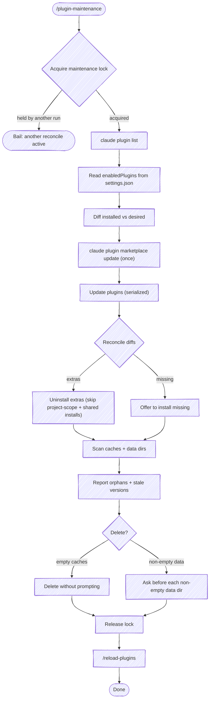

# Plugin Maintenance

Reconcile installed Claude Code plugins against the **desired set** declared in `~/.claude/settings.json` (`enabledPlugins`), then update what stays, install what's missing, uninstall what doesn't belong, and prune stale caches and data dirs.

Claude Code clears both directories on its own schedule, and what this skill changes is the timing. An uninstall deletes the plugin's data dir right away without asking, so Step 3 passes `--keep-data` to keep it for Step 5 to ask about. A superseded version cache it only marks orphaned, and a background sweep removes it around 14 days later, so pruning here reclaims two weeks of disk the user would otherwise carry. Confirmation before deletion is the point: data dirs may hold user state worth preserving.

## Source of truth

- **Desired plugins:** `~/.claude/settings.json` → `enabledPlugins` (a map of `<plugin>@<marketplace>` → bool). This is the set you've declared should be enabled; the disk state may have drifted from it.
- **Installed plugins:** `claude plugin list` output. Format: each entry has `<plugin>@<marketplace>`, `Version`, `Scope` (user/project/local), `Status` (enabled/disabled).

## Guardrail: a plugin shared by two marketplaces
<!-- covers: GUARD-03 -->

The same plugin can be published to more than one marketplace — a public marketplace and a separate mirror, say. When both are registered (common while migrating from one to the other), `claude plugin list` shows two rows for that plugin — `foo@marketplace-a` and `foo@marketplace-b` — but `installed_plugins.json` records the install **once**, under whichever marketplace it was installed from. The other row points at that same on-disk install.

`claude plugin uninstall foo@marketplace-a` then removes the plugin's only install record, uninstalling `foo` entirely — including the copy that was enabled and in use — and returns a success message regardless, so the command's exit can't confirm the intended "remove just this marketplace copy" effect.

**The tell:** a `<plugin>@<marketplace>` row in `claude plugin list` that has no matching key in `installed_plugins.json`, while another row for the same plugin name does. That row shares the single on-disk install — uninstalling it deletes the shared copy.

So gate every extra uninstall on the install manifest, not on `claude plugin list` plus the desired set alone (Step 3). A plugin with genuinely independent install records per marketplace — a key present in the manifest for each marketplace — is reconciled as before.

## Flow



## Output model: composition-first, scannable surfaces

The run is presented on three surfaces: an inventory summary + plan table up front, the native task list for progress, and a scannable final report at the end. **[references/output-format.md](references/output-format.md)** is the source of truth for all three: the shared emoji vocabulary, the composition line both the summary and the report lead with, the per-surface layouts, and the terminal-is-append-only reasoning behind them. Read it before rendering; the rest of this file assumes that vocabulary.

### Voice: report outcomes, not your reasoning
<!-- covers: REPORT-06, REPORT-07 -->

The user cares about **what changed and what they must do next** — not how you figured it out. Do the reasoning silently and emit only results.

- **No per-tool-call preambles.** Don't announce each command before running it ("Now let me refresh the marketplaces…", "Lock's held and inventory's in…"). Run the tool; let its result and the tables speak. Between steps, stay silent unless you hit something the user must decide.
- **No narrated investigation.** If a check surprises you — a lease reads as in-use, a version looks off — resolve it with silent tool calls, then report the *conclusion* in one line. Never walk the user through your hypotheses, your `ps` spelunking, or your "that's almost certainly wrong… actually it's correct" reversals. That is internal dialog; it belongs in no message.
- **Trust the skill's own tooling.** The lock script and `plugin-cache-in-use.sh` return verdicts you act on, not verdicts you audit out loud (see Step 4). If the script says a dir is in use, it's in use — report it and move on.
- **Stay in scope.** Report only this run's plugin maintenance. Don't append status on unrelated parked work, other sessions' tasks, or what you were doing before the skill was invoked.
- **The final summary is an emoji-tagged status block, not prose.** Emit surface 3 as the reference defines it, ending with the one action the user takes (`/reload-plugins`, or "nothing changed").

## Step 0: Take the maintenance lock
<!-- covers: RECON-01, RECON-02, RECON-03 -->

`claude plugin` has **no concurrency control**: install/update/uninstall all mutate the same shared state — the install manifest, the per-marketplace git clones, the per-version caches — with no locking. Two reconciles, or a reconcile overlapping another session's plugin operations, can interleave and leave that state in a mix neither intended (an uninstall in one session racing an update in another). So take a cooperative lock for the duration of the reconcile:

```bash
bash "${CLAUDE_PLUGIN_ROOT}/scripts/plugin-maintenance-lock.sh" acquire
```

- **Exit 0** — lock acquired (or already yours; it's re-entrant within a session). Proceed.
- **Exit 3** — another live session holds it. **Stop.** Tell the user another maintenance run is active (the script names the holding session and when it started on stderr) and that they should let it finish or, if it's a crashed run, wait for the lock to go stale. Don't reconcile past this.

Release it in Step 6, on every exit path. The lock self-clears if this run crashes (a lock older than the stale threshold is treated as abandoned and stolen by the next run), so a missed release degrades to a stale-lock steal, not a permanent block.

## Step 1: Inventory
<!-- covers: RECON-05, RECON-06, AUTO-06 -->

These are read-only reads of disk state — safe to run in parallel (the concurrency hazard is only among *mutating* `claude plugin` operations, handled in Step 2):

```bash
claude plugin list
```

```bash
cat ~/.claude/settings.json | jq '.enabledPlugins'
```

Build two sets of `<plugin>@<marketplace>` keys: **installed** (with scope) and **desired**. Note the enabled/disabled split while you're here — it feeds the composition line. Once you've diffed them (Step 3's classification), render the **inventory summary + plan table** (surface 1 in references/output-format.md) — the composition line (installed / enabled / disabled) the user sees before anything changes.

Also read the install manifest — Step 3 gates uninstalls on it (see "a plugin shared by two marketplaces"):

```bash
jq '.plugins | keys' ~/.claude/plugins/installed_plugins.json
```

The manifest keys by the same `<plugin>@<marketplace>` form. A `claude plugin list` row whose key is absent here shares another marketplace's single on-disk install.

While you have the marketplace state, note **auto-update** coverage for the final report. The registered marketplaces are the keys of `~/.claude/plugins/known_marketplaces.json`; a marketplace is auto-updating when `extraKnownMarketplaces.<name>.autoUpdate` is `true` in `~/.claude/settings.json`. Read the two together, the way the hook does, so a marketplace that has no settings entry at all still gets a row:

```bash
jq -rn --slurpfile k ~/.claude/plugins/known_marketplaces.json --slurpfile s ~/.claude/settings.json '
  (($s[0].extraKnownMarketplaces // {}) as $ex
   | $k[0] | keys[] | "\(.): \(($ex[.].autoUpdate // false))")'
```

Enumerating `extraKnownMarketplaces` alone would report the wrong set and fail on the state that matters most: a marketplace missing from it is the one the hook is about to arm, and it shows up as no row rather than `false`, while a settings file with no such key at all makes the whole expression error.

shipshape's `SessionStart` hook enforces this — it arms any marketplace missing the flag, effective next launch — so the skill only **reports** status here; it doesn't write. Surface any marketplace still showing `false` so the user knows the hook will pick it up.

## Step 2: Update plugins
<!-- covers: RECON-07, RECON-08, RECON-09, RECON-14 -->

**Do not blanket-parallelize updates.** `claude plugin update` refreshes the plugin's marketplace by re-cloning it; run several updates for plugins from the *same* marketplace at once (the common case) and the clones collide (`destination path already exists and is not an empty directory`), so some updates fail with `Plugin not found` and are silently skipped in the parallel output. The marketplace isn't damaged — a sequential retry succeeds immediately — but the failure hides in the noise.

Instead, **refresh every marketplace once, up front** (one command, internally sequential), so the per-plugin updates that follow aren't each re-cloning:

```bash
claude plugin marketplace update
```

Then update each plugin **serialized** — one at a time, not a parallel batch:

```bash
claude plugin update <plugin>@<marketplace>
```

**A marketplace-declared command is a hard stop, not a retry.** A catalog entry may declare a `headersHelper` (a command that mints the HTTP headers for the plugin's archive fetch) or a `command` source (a command that prints the plugin directory). Claude Code runs either one only against the user's explicit acceptance, and it will not take that acceptance from inside a session: this pass has no TTY to prompt on, so the command is printed, not accepted, and the update fails with `fetches its archive through a headersHelper command that was not run` or `… has not been reviewed yet, so it was not run`. The plugin was not updated.

`-y` doesn't reach it — inside a Claude Code session the flag is ignored outright (`-y/--yes is ignored inside a Claude Code session`), so passing it changes only which warning prints. Report the plugin ⌨️ **needs your terminal** and quote the one line for the user to run in their own shell, where the prompt appears and they can review the command before accepting it. Don't retry it as a transient failure: the refusal is a standing consent gap, and a retry prints the same warning.

Updates are fast and network-bound, and with the marketplaces already refreshed each one is cheap; the clone-collision cost far outweighs the parallelism. (If speed ever matters on a large set, the only safe parallelism is across *distinct* marketplaces — never two updates of the same marketplace at once.)

**Surface and retry failures — never lose one in the output.** If an update reports `Plugin not found` or another transient error, retry it once serially and reflect the real outcome in the final report. An update that stays failed is a row the user needs to see, not a silent gap.

Track the pass on the **native task list** (surface 2 in references/output-format.md) — mark the `Update plugins` task `in_progress` before the first update, `completed` after the last. Don't emit a line per plugin; the results land in the final report (Step 3).

## Step 3: Reconcile differences
<!-- covers: RECON-10, RECON-11, RECON-11a, RECON-14, GUARD-01, GUARD-02 -->

- **Extras** (installed, not desired):
  - **Shared on-disk install** (see the guardrail above — the extra's key is absent from `installed_plugins.json` while another row for the same plugin name is present) → **do not uninstall.** Removing this marketplace key deletes the plugin's only install record, taking the enabled copy with it. Surface it as a warning with the manifest-vs-list evidence and let the user resolve it deliberately (re-point `enabledPlugins`, or uninstall and reinstall from the desired marketplace). Report as "skipped (shared install)".
  - **User-scope** → `claude plugin uninstall <plugin>@<marketplace> -y --keep-data`, then confirm against the manifest: re-read `installed_plugins.json` and check the key is gone. The uninstall reports success regardless, so verify the effect rather than trusting the message.

    `--keep-data` is not optional. Uninstalling from a plugin's last remaining scope deletes its `${CLAUDE_PLUGIN_DATA}` directory, so without the flag Step 3 destroys accumulated user state before Step 5 gets to ask about it. Keeping the dir hands it to Step 4, which classifies it as an orphan, and to Step 5, which asks before removing anything non-empty. A data dir the user agrees to lose is one they were shown first.
  - **Project-scope** → **do not uninstall.** These are checked into a repo's `.claude/settings.json` and shared with the team, so they aren't yours to remove. Skip with a warning ("team-shared via repo settings; remove from the repo's `.claude/settings.json` instead") and report as "skipped (team-shared)". User-scope plugins are the personal ones, safe to reconcile.
- **Missing** (desired, not installed):
  - Offer to install: `claude plugin install <plugin>@<marketplace>`
  - Ask before installing — the desired set may be aspirational or out-of-date.
  - If the install fails on a marketplace-declared command (see Step 2), report it ⌨️ **needs your terminal** with the same line for the user's own shell. Their yes to the offer can't stand in for the acceptance Claude Code requires at the prompt.

The reconcile outcomes feed the **final report** (surface 3 in references/output-format.md), which defines the emoji each status maps to. If nothing changed at all, the report is the composition line plus a one-line "nothing to reconcile."

## Step 4: Scan caches and data dirs
<!-- covers: PRUNE-01, PRUNE-02, PRUNE-03, PRUNE-04, PRUNE-05, PRUNE-12, PRUNE-16 -->

One call walks both directories and classifies everything in them:

```bash
bash "${CLAUDE_PLUGIN_ROOT}/scripts/plugin-cache-scan.sh"
```

It reports by exception — a row per entry that is **not** part of a current install, then a `#totals` line:

```text
cache/chris-peterson/beacon/2.3.0|stale|prunable|3.1M
cache/chris-peterson/beacon/2.4.0|stale|in-use|3.2M
cache/mp/gone-plugin/1.0.0|orphan|prunable|2.1M
cache/mp/gone-plugin|empty-plugin|prunable|0K
cache/synced/helper/2.0.0|unknown-origin|skipped|1.4M
data/old-plugin-old-mp|orphan-data|nonempty|412K
#totals stale=1 stale_in_use=1 orphan=1 orphan_in_use=0 empty_plugin=1 orphan_data=1 unknown_origin=1 reclaimable=5.2M
```

The fields are `path|class|verdict|size`, and the path is the form Step 5 hands back.

| class | What it is |
|---|---|
| `stale` | the plugin is installed on a different version; every update leaves one |
| `orphan` | nothing installed claims this cache at all |
| `empty-plugin` | a `cache/<mp>/<plugin>/` dir whose versions are all gone |
| `orphan-data` | a data dir matching no installed plugin |
| `unknown-origin` | its origin is not a marketplace in `known_marketplaces.json` |

`verdict` is `prunable`, `in-use`, or `skipped` for a cache dir, and `empty` or `nonempty` for a data dir. **`prunable` is Step 5's input; nothing else is.**

**An `unknown-origin` entry is never pruned.** The top level of `cache/` is a marketplace name everywhere except where Claude Code puts something else there: `synced` holds plugins the user turned on in claude.ai, which nothing local installed and nothing local can reinstall. Those carry no manifest row, so the manifest alone would read them as orphans. They are reported rather than hidden because the same class covers what a marketplace the user removed left behind, and that is worth seeing. Fold the count into the stale-cache line; a row of its own is warranted only where the user asked about one.

**The scan is the classification — don't redo it.** It reads `installed_plugins.json`, whose rows record the exact `installPath` behind each install, so a dir is current because the manifest points at it. That settles the shared-install case (see the guardrail above) without comparing version strings. Entries backing a current install are omitted, and a `-inline` data dir never appears at all — it's an artifact of testing a plugin locally, not drift. Don't run your own `find`, don't re-check a verdict, and don't add a row the scan didn't print.

Exit 1 means `jq` is missing or there's no install manifest: nothing was classified. Report that and skip Step 5 rather than pruning off a partial picture.

### Respect `.in_use` leases
<!-- covers: PRUNE-06, PRUNE-07, PRUNE-08, REPORT-05 -->

Each version dir carries an `.in_use/` directory in which every running session drops a lease file — `{"pid":<n>,"procStart":"<ts>"}`. It's a reference count: the dir is **live** while any lease names a running process whose start time still matches that lease's `procStart`. A live-leased dir is never deleted — another session loaded that version at startup, and pruning it breaks that session until it restarts.

`plugin-cache-in-use.sh` owns the comparison, and both scripts call it for you: the scan to set the `in-use` verdict, the prune to re-check immediately before each delete. It's conservative by design — a missing or unparseable `procStart`, or a `date` dialect it can't read, all count as in use, so uncertainty never prunes. Its header is the source of truth for how the comparison works.

**Act on the verdict; don't audit it.** A run where every stale dir reads as in-use is normal (background spares and long-lived sessions pin the versions they loaded); it is **not** a signal to go verify the script with your own `ps` calls. If you genuinely suspect a bug, that's a note to file against this skill later — not a live investigation narrated into the run.

**Report by exception here too.** Stale-version caches are routine — every update leaves one — and they're auto-deletable, so they don't warrant a row each. Roll them into a single line, count and total size, straight off `#totals`. Reserve table rows for the class that needs user judgment: a genuine **orphan** cache or data dir. If there are none, a one-line summary is the whole report.

```text
Stale-version caches: 12 dirs, ~70M — auto-pruned.
```

When some or all are pinned by a live lease, say so in the same one line — a count, not a roster of which sessions hold what. The holders' PIDs, start times, and command lines are internal; the user needs only that they're pinned and clear on their own:

```text
Stale-version caches: 22 dirs, ~10M — skipped, pinned by live sessions (they free up as those sessions exit).
```

When a genuine orphan is present, table only those:

```text
| Path                                     | Class       | Size |
|------------------------------------------|-------------|------|
| ~/.claude/plugins/data/old-plugin-old-mp | orphan data | 412K |
| ~/.claude/plugins/cache/mp/gone-plugin   | orphan cache| 2.1M |
```

## Step 5: Clean up (with confirmation)
<!-- covers: PRUNE-09, PRUNE-10, PRUNE-11, PRUNE-13, PRUNE-14, PRUNE-15, PRUNE-16 -->

Hand the prune script every `prunable` path the scan printed, as arguments:

```bash
bash "${CLAUDE_PLUGIN_ROOT}/scripts/plugin-cache-prune.sh" cache/mp/plugin/1.0.0 cache/mp/plugin/1.1.0 cache/mp/gone-plugin
```

It prints a line per path and a `pruned=… skipped=… freed=…` total, and clears any plugin dir its own deletes left empty.

**Never hand-roll the loop** — no `rm -rf` of your own, no `find -delete`, no one-off script written for the run. The guarantees live in this script: it refuses anything that isn't a cache version dir, a cache plugin dir, or a data dir, which is what puts `cache/<mp>/`, `cache/`, and `data/` out of reach at any depth; it skips any entry whose origin is not a registered marketplace, so a `synced` plugin survives even if one reaches the call; it clears an empty plugin dir with `rmdir` rather than a recursive delete; and it re-checks each lease at delete time instead of trusting a scan that may be minutes old.

**A `nonempty` orphan data dir is the one thing to ask about first.** It may hold accumulated user state — settings, history, context. Quote its size and a sample of file names, and pass the flag only on a yes:

```bash
bash "${CLAUDE_PLUGIN_ROOT}/scripts/plugin-cache-prune.sh" --data-confirmed data/old-plugin-old-mp
```

Without the flag the script skips it and says why, so a forgotten ask degrades to "nothing happened" rather than to a deleted dir.

An `in-use` path needs no handling — leave it out of the call and report it as skipped. Passing one anyway is safe (the script re-checks and skips it), but the report should say pinned, not pruned.

Exit 2 means a path was refused as malformed. That's a bug in what you passed rather than something the user acts on: the reason is on stderr, nothing at that path was touched, and the valid paths in the same call still went through.

## Step 6: Reload plugins
<!-- covers: RECON-04, RECON-12, RECON-13 -->

**First, release the maintenance lock from Step 0** — the mutating work is done, so hold it no longer than necessary (the reload is a human action outside this run):

```bash
bash "${CLAUDE_PLUGIN_ROOT}/scripts/plugin-maintenance-lock.sh" release
```

Release on every exit path, including the early ones — if you bailed out mid-reconcile after acquiring the lock, release it before you stop. (A missed release isn't fatal: the lock goes stale and the next run steals it, but an explicit release frees a waiting session immediately.)

Installs, uninstalls, and updates change plugins on disk but don't take effect in the running session — Claude Code reads the plugin set once at startup and freezes it. `/reload-plugins` re-reads it in place (no restart). It's a built-in command that only a human can type: there's no CLI flag, hook, or skill that triggers a reload, and no way to reload across sessions — each running session is an independent process. So the reconcile only lands where the user runs the reload:

```text
Ask the user to run /reload-plugins in this session — and in any other active
Claude Code session, since each loads plugins independently. If it warns that
the reload will re-read the conversation, it has skipped: rerun it as
/reload-plugins --force.
```

Name the `--force` rerun in the ask, not after the user reports the warning. A reload that would invalidate the prompt cache warns and does nothing until it's rerun with the flag, so a plain "run `/reload-plugins`" can leave the reconcile unapplied while reading as done.

Two notes worth stating in the report:

- **Other running sessions still need their own reload.** This reconcile only landed in the session that ran it; every other live session keeps the plugin set it loaded at startup until it reloads or restarts. (Their *loaded* version dirs were protected from pruning by the `.in_use` check in Step 5 — they're stale, not broken.)
- **Auto-update makes reloads routine, not rare.** Claude Code checks for marketplace and plugin updates *after* a session starts, with a random delay of up to ten minutes, so a session launches on whatever was on disk and picks the new versions up either through a reload it prompts for or at the next launch. With shipshape's `SessionStart` hook arming auto-update, expect that prompt in ordinary sessions — this step isn't only for the session that ran a manual reconcile.

Skip this entirely if Step 3 made no changes and Step 5 pruned nothing — there's nothing to reload.

## CLI reference

```bash
claude plugin list                                    # inventory
claude plugin marketplace update                       # refresh all marketplaces once (do before updates)
claude plugin update <plugin>@<marketplace>           # update (run serialized, not in parallel)
claude plugin install <plugin>@<marketplace>          # install
claude plugin uninstall <plugin>@<marketplace> -y --keep-data   # uninstall, keeping the data dir for Step 5 to ask about
claude plugin --help                                  # full subcommand list (includes prune, enable, disable)
```

`claude plugin prune` removes auto-installed dependencies that are no longer needed but does **not** touch caches or data dirs — that's still this skill's job.

## Paths

```text
Settings:              ~/.claude/settings.json  (enabledPlugins = desired set)
Cache:                 ~/.claude/plugins/cache/<marketplace>/<plugin>/<version>/
Data:                  ~/.claude/plugins/data/<plugin>-<marketplace>/
Known marketplaces:    ~/.claude/plugins/known_marketplaces.json
Installed manifest:    ~/.claude/plugins/installed_plugins.json
Maintenance lock:      ~/.claude/plugins/.plugin-maintenance.lock
```
